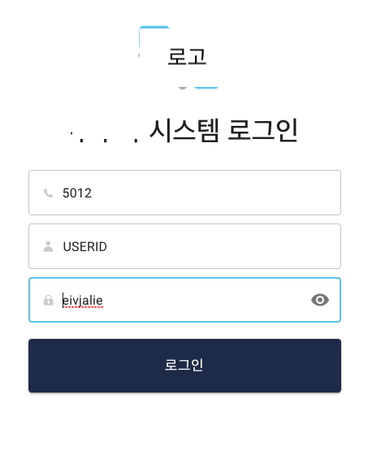
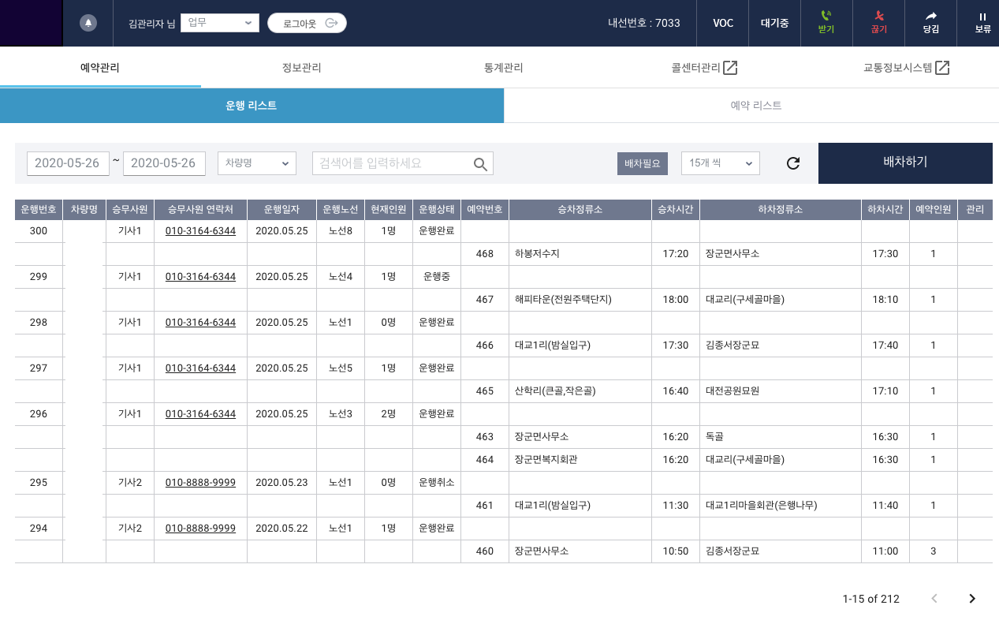
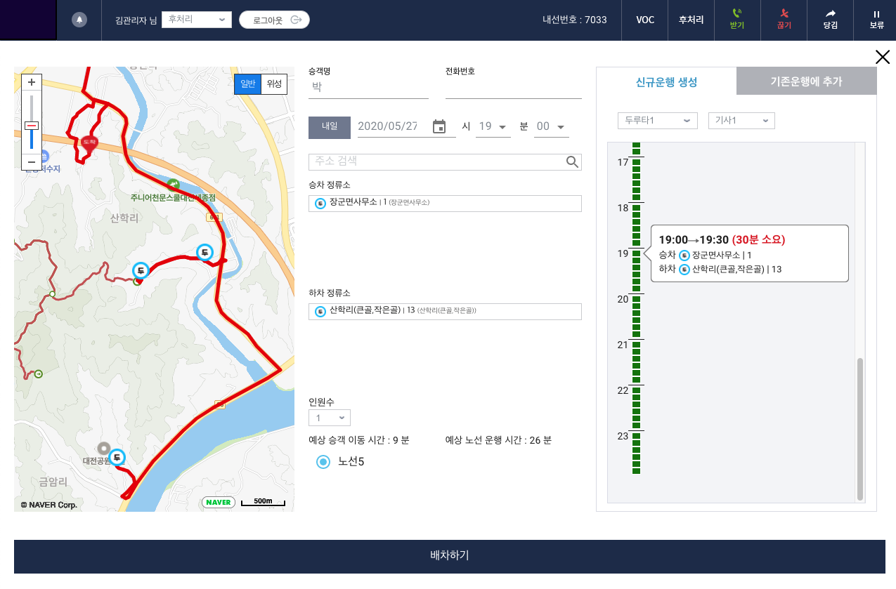
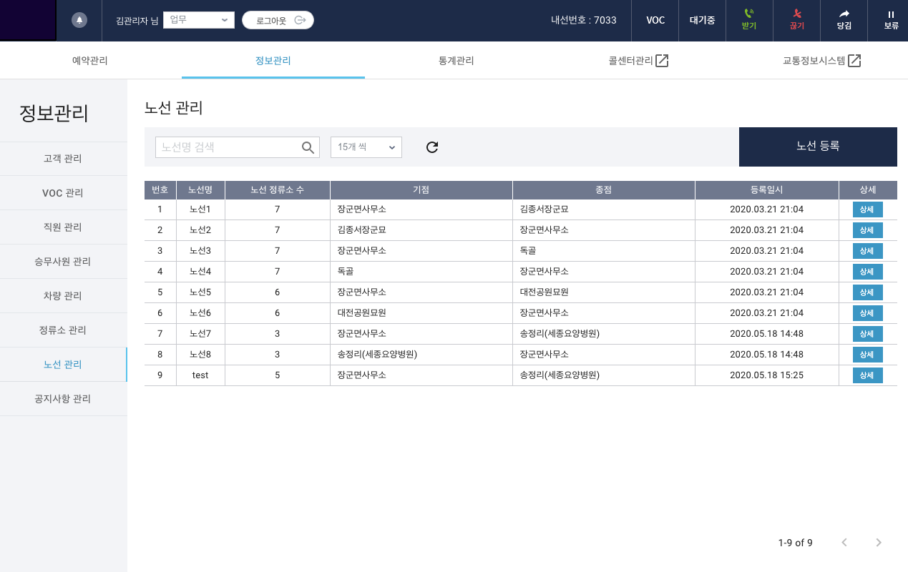
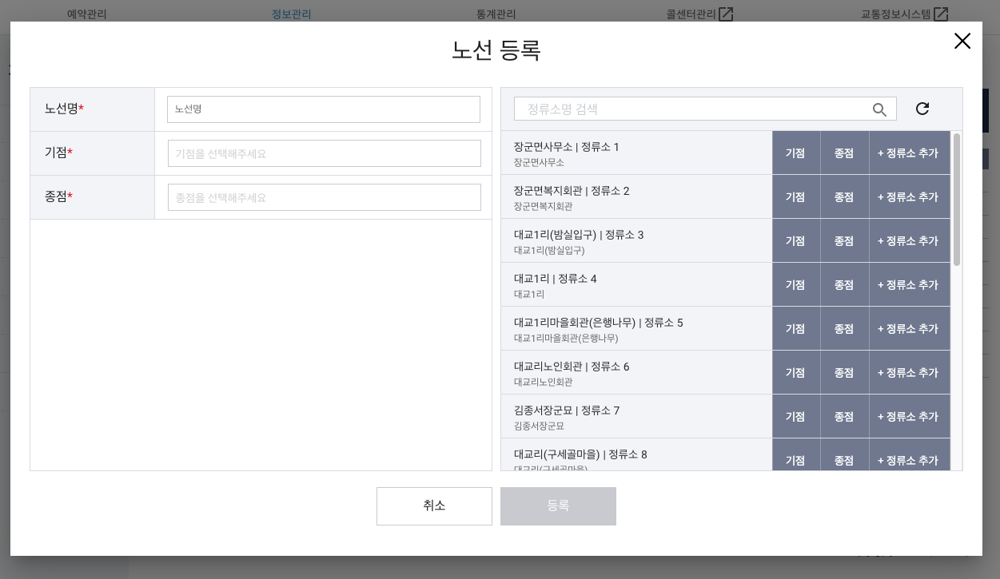
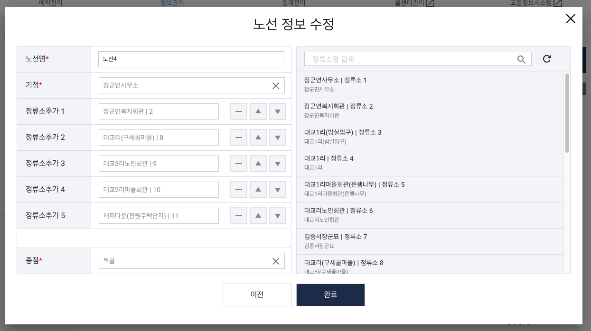
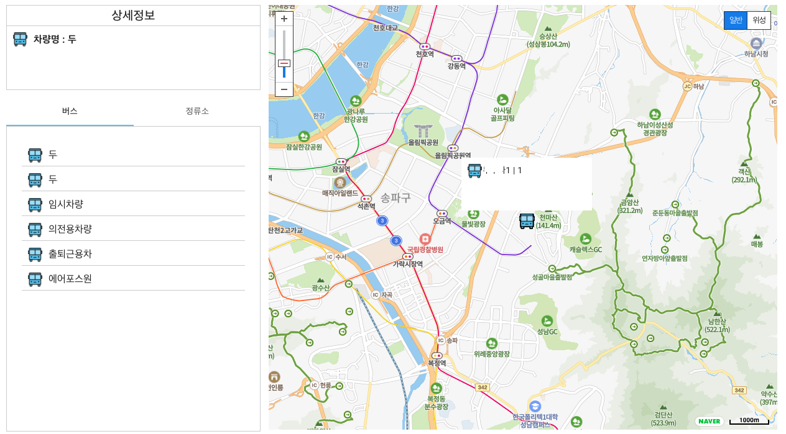
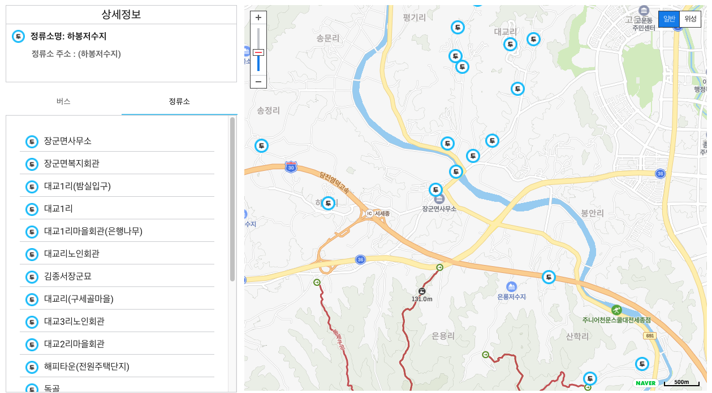
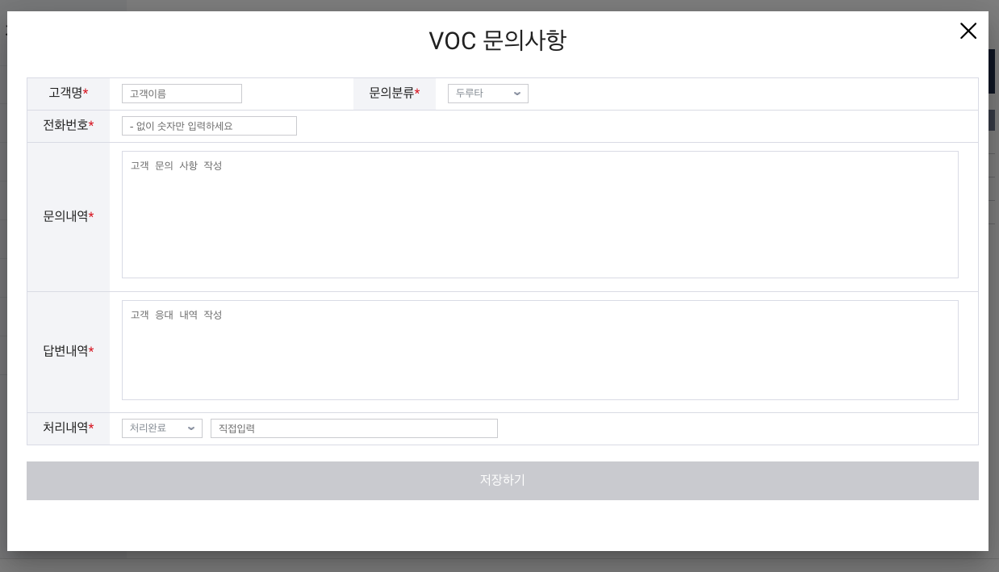
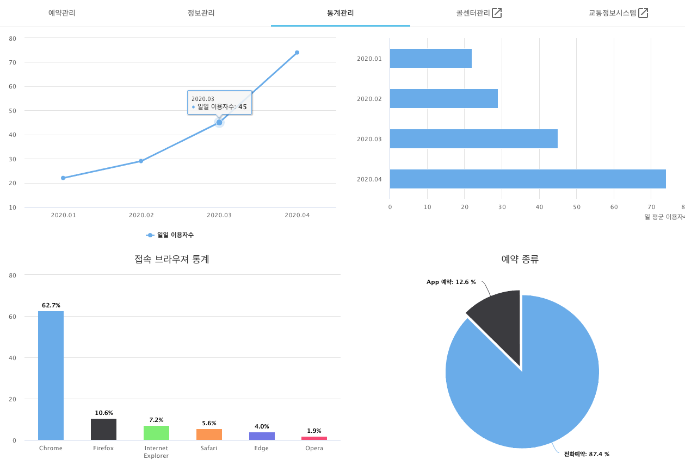

# DRT-System
DRT (Demand Responsive Transport) 수요응답형교통 시스템 

[ Front-end ]  React , Next.js , Hooks , Redux 

React Next.js 로 개발한 소스중 일부입니다. Page , Component 참고용으로 봐주시면 감사하겠습니다.

초기 버전 테스트

https://duruta-nextjs-k0sc8tuu6.now.sh/

디자인 변경 버전 테스트   ( DB, 지도 연동이 없고 테스트용이니 참고로 봐주세요 :)

https://drt-nextjs.vercel.app/

# Screenshot

로그인화면

메인화면

네이버지도 , 티맵 경로 api를 이용한 차량배차 시스템

정보관리 화면

등록화면 , 수정화면

교통정보시스템(차량위치,정류소위치 등)

문의 등록창

통계 예시

